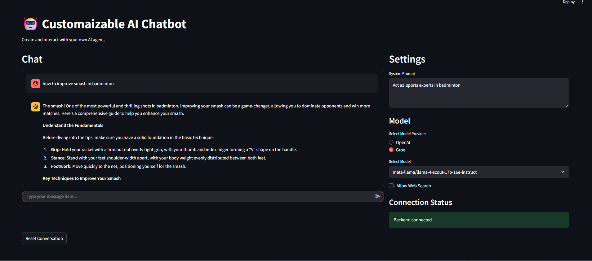

# 🤖 AI Chatbot Application

This is a simple AI chatbot application built using **Streamlit** for the frontend and **FastAPI** for the backend. The application allows users to interact with AI models and receive intelligent responses based on their queries.

---

## ✨ Features

- 🧠 Chat with AI models (OpenAI GPT-4 and Groq LLaMA)
- 💬 User-friendly interface for entering system prompts and queries
- 🌐 Optional web search for enriched answers
- 📋 Structured response display
- ⚡ FastAPI backend for efficient processing

---

## 🛠️ Technologies Used

- **Frontend**: Streamlit  
- **Backend**: FastAPI  
- **AI Models**: OpenAI GPT-4, Groq LLaMA  
- **Languages/Libraries**: Python, `requests`, `pydantic`  

---

## 🚀 Installation

Follow these steps to run the application locally:

### 1. Clone the Repository

```bash
git clone "https://github.com/muhmmadshaban/AI-AGENT-CHATBOT-WITH-FASTAPI"
cd main
```

### 2. Set Up a Virtual Environment (optional but recommended)

```bash
python -m venv venv
# On Windows:
venv\Scripts\activate
# On macOS/Linux:
source venv/bin/activate
```

### 3. Install Dependencies

```bash
pip install -r requirements.txt
```

### 4. Run the Backend (FastAPI)

```bash
uvicorn main:app --host 127.0.0.1 --port 9999 --reload
```

---

## 🔑 API Keys Setup

To run this application, you need to obtain API keys from the following providers:

- **Groq**: Obtain your API key from the [Groq Cloud](https://groq.com/)
- **OpenAI**: Obtain your API key from the [OpenAI platform](https://platform.openai.com/)
- **Tavily**: Obtain your API key from the [Tavily website](https://tavily.com/)

After getting the keys, create a `.env` file in the root directory of the project and add the following lines:

```env
GROQ_API_KEY="your_groq_api_key_here"
TAVILY_API_KEY="your_tavily_api_key_here"
OPENAI_API_KEY="your_openai_api_key_here"
```


---
### 5. Run the Frontend (Streamlit)

```bash
streamlit run app.py
```

---

## 🌐 Usage

1. Open your browser and go to:  
   [http://localhost:8501](http://localhost:8501)

2. Enter:
   - A **system prompt**
   - A **user query**
   - Choose an **AI model** (OpenAI or Groq)

3. Click **Submit**, and view the AI's response below.

---

## 📡 API Endpoint

The backend API is accessible at:

```
http://127.0.0.1:9999/chat
```

### Request Format (JSON)

```json
{
  "system_prompt": "You are a helpful assistant.",
  "user_query": "What is the capital of France?",
  "provider": "openai",
  "web_search": false
}
```

---

## 🖼️ Screenshot

Here is what the chatbot interface looks like:




---

## 👤 Author

**Muhmmad Shaban**  
📧 mshaban0121@gmail.com  
🔗 [www.linkedin.com/in/muhmmadshaban](LINKEDIN )

---

## 📄 License

This project is licensed under the **MIT License**.  
See the [LICENSE](LICENSE) file for more details.
